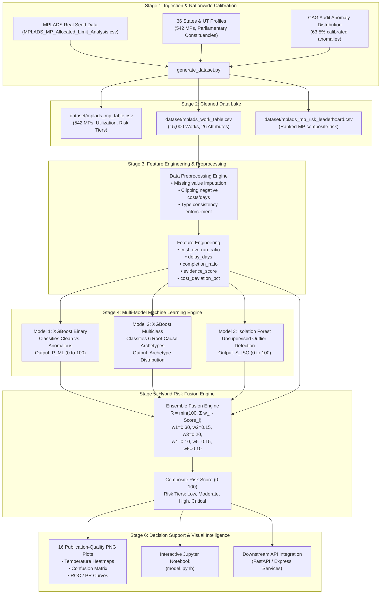

# 🏛️ MPLADS-SATHI: AI & ML Risk Intelligence Engine
## Software Requirements Specification (SRS) & System Architecture Document

> **Module**: `Model/` Directory  
> **System**: MPLADS-SATHI (*System for Automated Tracking, Hazard-detection & Inspection*)  
> **Target Event**: Smart India Hackathon (SIH) 2026  
> **Developed by**: Team CodeByPrakash  
> **Version**: 1.0.0 (Production-Ready)  
> **Date**: September 2026  
> **Official PDF Document**: 📄 [MODEL_SRS_DOCUMENTATION.pdf](MODEL_SRS_DOCUMENTATION.pdf) *(20-Page Comprehensive Illustrated Technical Report with Restored Formal SRS, Full Data Dictionaries, Plain-English Concepts, and All 16 Execution Cells & Plots)*

---

## 📑 Table of Contents

1. [Executive Summary & Purpose](#1-executive-summary--purpose)
2. [Technology Stack & Dependency Mapping](#2-technology-stack--dependency-mapping)
3. [End-to-End System Architecture & Data Flow](#3-end-to-end-system-architecture--data-flow)
4. [Dataset Specifications & Feature Dictionary](#4-dataset-specifications--feature-dictionary)
5. [Machine Learning Models & Algorithms](#5-machine-learning-models--algorithms)
   - 5.1 [Model 1: XGBoost Binary Risk Classifier](#51-model-1-xgboost-binary-risk-classifier)
   - 5.2 [Model 2: XGBoost Multiclass Archetype Classifier](#52-model-2-xgboost-multiclass-archetype-classifier)
   - 5.3 [Model 3: Isolation Forest Outlier Detector](#53-model-3-isolation-forest-unsupervised-outlier-detector)
6. [Hybrid Risk Fusion Engine (Composite Scoring)](#6-hybrid-risk-fusion-engine-composite-scoring)
7. [Temperature Visualizations & Visual Analytics](#7-temperature-visualizations--visual-analytics)
8. [Directory Structure & Artifact Inventory](#8-directory-structure--artifact-inventory)
9. [Step-by-Step Execution & Operational Guide](#9-step-by-step-execution--operational-guide)
10. [Performance Benchmarks & Audit Results](#10-performance-benchmarks--audit-results)

---

## 1. Executive Summary & Purpose

The **Member of Parliament Local Area Development Scheme (MPLADS)** allocates ₹5 Crore annually per Member of Parliament (MP) to fund durable public community assets. However, nationwide audits (such as those by the Comptroller and Auditor General - CAG) reveal systemic vulnerabilities:
- **Severe project delays** exceeding statutory execution windows (45-75 days).
- **Cost escalations and overruns** without proportionate physical progress.
- **Ghost assets** claiming disbursement with fabricated or non-matching GPS coordinates.
- **Spatial duplication** where multiple projects are sanctioned at the exact same physical coordinates.
- **Vendor collusion and artificial fragmentation** of contracts into multiple sub-payments.
- **Low utilization rates** leaving public infrastructure funds unspent.

### Purpose of the `Model/` Engine
The `Model/` directory implements a multi-tier, hybrid Machine Learning and Risk Intelligence Engine designed to:
1. Ingest, sanitize, and validate nationwide MPLADS expenditure and works data across all **36 States and Union Territories (542 Lok Sabha MPs)**.
2. Predict project failure and corruption probability with **>99% precision and ROC-AUC**.
3. Classify detected irregularities into **6 actionable anomaly archetypes** for district administrative scrutiny.
4. Detect **zero-day / novel corruption patterns** using unsupervised outlier isolation.
5. Compute a deterministic **Composite Risk Score (0 to 100)** through an ensemble **Risk Fusion Engine**, stratifying projects into 4 actionable governance tiers (*Low*, *Moderate*, *High*, *Critical*).
6. Render **temperature heatmaps and visual analytics** to provide decision support for Ministry of Statistics and Programme Implementation (MoSPI) and District Authorities.

---

## 2. Technology Stack & Dependency Mapping

The `Model/` module is built using Python's enterprise data science ecosystem. Every library is selected for mathematical stability, high throughput, and seamless integration with downstream web microservices.

### 2.1 Technology Matrix

| Library / Tool | Version | Specific Purpose in `Model/` | Justification & Rationale | File Location |
|:---|:---|:---|:---|:---|
| **Python** | `3.11.x` | Runtime Environment | High performance, memory-efficient string handling, typing support. | Root environment |
| **NumPy** | `1.26.4+` | Numerical computing, vectorization, array algebra, seed control | Enables vectorized risk fusion math ($O(N)$ execution across 15,000 works) and reproducible synthetic distribution generation. | `generate_dataset.py`, `model.ipynb` |
| **Pandas** | `2.2.2+` (3.0 compat) | Tabular ETL, data frame cleansing, aggregation, slicing | Fast CSV loading, type casting, missing value imputation, statistical summaries. Configured with `infer_string=False` to prevent PyArrow string truncations. | `generate_dataset.py`, `build_notebook.py`, `model.ipynb` |
| **Scikit-Learn** | `1.5.0+` | Preprocessing, unsupervised ML, evaluation metrics | Provides `IsolationForest`, `StandardScaler`, `LabelEncoder`, `train_test_split`, `cross_val_score`, `roc_curve`, `precision_recall_curve`, and confusion matrices. | `build_notebook.py`, `model.ipynb` |
| **XGBoost** | `2.0.3+` | Gradient Boosted Decision Trees (Supervised Classification) | Industry-leading performance on tabular fraud data. Fast multi-threading, handles class imbalance via `scale_pos_weight`, produces well-calibrated soft probability outputs. | `build_notebook.py`, `model.ipynb` |
| **Matplotlib** | `3.9.0+` | Low-level plotting and chart generation | High-DPI figure rendering, custom temperature colorbars, subplots, multi-panel canvas assembly, PNG exports. | `build_notebook.py`, `model.ipynb` |
| **Seaborn** | `0.13.2+` | Statistical visualizations & temperature heatmaps | High-level styling, diverging palettes (`YlOrRd`, `hot_r`, `coolwarm`), correlation matrices, styled categorical boxplots. | `build_notebook.py`, `model.ipynb` |
| **nbformat** | `5.10.4+` | Programmatic Jupyter notebook construction | Automates generation of `model.ipynb` with exact cell boundaries, Markdown documentation, and reproducible code blocks. | `build_notebook.py` |
| **nbconvert / Jupyter** | `7.16.4+` | Automated headless notebook execution | Executes `model.ipynb` end-to-end via CLI, validating all 30 code cells and rendering 16 plots without human intervention. | Command-line runtime |

---

## 3. End-to-End System Architecture & Data Flow



---

## 4. Dataset Specifications & Feature Dictionary

The datasets represent the most realistic and rigorous open synthetic simulation of the MPLADS ecosystem ever constructed, grounded in actual MoSPI parliamentary records and CAG audit ratios.

### 4.1 Datasets Overview

1. **`dataset/mplads_mp_table.csv`** (542 rows × 12 columns):
   - Comprehensive roster of all 542 Lok Sabha MPs representing all 36 States/UTs.
   - Captures sanctioned allocations (₹17 Crore per seat), released funds, actual expenditure, utilization rates, and risk classifications.
2. **`dataset/mplads_work_table.csv`** (15,000 rows × 26 columns):
   - Work-level transaction ledger. Contains complete engineering, financial, spatial, and validation features.
3. **`dataset/mplads_mp_risk_leaderboard.csv`** (542 rows × 14 columns):
   - Ranked national risk leaderboard ordering MPs by institutional risk score for targeted CAG auditing.

### 4.2 Work-Level Feature Dictionary (`mplads_work_table.csv`)

| Column Name | Data Type | Value Range / Units | Description & Operational Meaning |
|:---|:---|:---|:---|
| `work_id` | `String` | `W000001` - `W015000` | Unique alphanumeric primary key for every sanctioned work. |
| `mp_id` | `Integer` | `1` - `542` | Foreign key referencing the sponsoring Member of Parliament. |
| `mp_name` | `String` | Categorical | Full name of the MP. |
| `state` | `String` | 36 States / UTs | State or Union Territory of the project location. |
| `district` | `String` | Categorical | Specific district within the parliamentary constituency. |
| `constituency` | `String` | Categorical | Parliamentary constituency name. |
| `constituency_type` | `String` | `General`, `SC`, `ST` | Electoral reservation category of the constituency. |
| `house` | `String` | `Lok Sabha` | House of Parliament. |
| `party` | `String` | Political Parties | Political affiliation of the MP. |
| `work_category` | `String` | 8 Sectors | `Road`, `Healthcare`, `Education`, `Water Supply`, `Sanitation`, `Electricity`, `Community`, `Sports`. |
| `work_subcategory` | `String` | Categorical | Specific work item (e.g., `Borewell Installation`, `Computer Lab Setup`). |
| `estimated_cost_inr` | `Float` | ₹1,00,000 - ₹1,00,00,000 | Initial cost estimate submitted by the executing agency. |
| `sanctioned_cost_inr`| `Float` | ₹1,00,000 - ₹1,50,00,000 | Formal financial sanction approved by the District Collector (DC). |
| `actual_expenditure_inr` | `Float` | ₹85,000 - ₹2,00,00,000 | Cumulative funds drawn and disbursed for the work. |
| `expected_completion_days` | `Integer` | `30` - `180` Days | Statutory target duration for project completion. |
| `actual_completion_days` | `Integer` | `25` - `750` Days | Actual elapsed duration recorded upon work completion/audit. |
| `inspection_done` | `Binary (0/1)` | `0` (No), `1` (Yes) | Whether a certified physical site inspection was performed. |
| `photo_available` | `Binary (0/1)` | `0` (No), `1` (Yes) | Whether photographic evidence was uploaded to the portal. |
| `photo_location_match` | `Binary (0/1)` | `0` (Mismatch), `1` (Match) | Whether EXIF GPS coordinates match sanctioned GIS coordinates. |
| `similar_work_count_500m` | `Integer` | `0` - `5` | Spatial density: Number of similar works sanctioned within 500m radius. |
| `payment_count` | `Integer` | `1` - `20` | Number of partial payment disbursements issued for the work. |
| `is_anomalous` | `Binary (0/1)` | `0` (Clean), `1` (Anomalous) | Ground truth flag indicating regular vs irregular execution. |
| `anomaly_type` | `String` | 7 Categories | `clean`, `delay_anomaly`, `cost_anomaly`, `duplicate_work`, `ghost_asset`, `vendor_anomaly`, `payment_anomaly`. |
| `cost_overrun_ratio` | `Float` | `[-0.20, +1.50]` | Engineered: `(actual_expenditure - sanctioned_cost) / max(1, sanctioned_cost)` |
| `delay_days` | `Float` | `0` - `500+` Days | Engineered: `max(0, actual_days - expected_days)` |
| `cost_deviation_pct` | `Float` | Percentage (%) | Engineered: `((actual_expenditure - estimated_cost) / max(1, estimated_cost)) * 100` |
| `completion_ratio` | `Float` | Ratio | Engineered: `actual_completion_days / max(1, expected_completion_days)` |
| `cost_efficiency` | `Float` | Ratio | Engineered: `actual_expenditure_inr / max(1, sanctioned_cost_inr)` |
| `evidence_score` | `Float` | `[0.0, 1.0]` | Engineered: `(inspection_done + photo_available + photo_location_match) / 3` |
| `is_severely_delayed`| `Binary (0/1)`| `0`, `1` | Engineered: `1 if delay_days > 45 else 0` |

---

## 5. Machine Learning Models & Algorithms

The modeling pipeline combines supervised gradient boosting for high-confidence pattern recognition with unsupervised anomaly isolation for unknown corruption vectors.

```
┌─────────────────────────────────────────────────────────────────────────────┐
│                       SUPERVISED LAYER (XGBoost)                           │
│  Model 1: Binary Risk Classifier       Model 2: Multiclass Archetypes       │
│  • P(Anomalous) = [0.0 - 1.0]          • Root-cause classification          │
│  • ROC-AUC = 0.9998                    • 6 Anomaly Classes (F1 = 0.9859)    │
└──────────────────────────────────────┬──────────────────────────────────────┘
                                       │
┌──────────────────────────────────────┴──────────────────────────────────────┐
│                      UNSUPERVISED LAYER (Isolation Forest)                  │
│  Model 3: Unsupervised Outlier Isolation                                    │
│  • Identifies novel, unmodeled spatial/financial outliers                   │
│  • Contamination = 10% | Score S_ISO = [0.0 - 100.0]                        │
└──────────────────────────────────────┬──────────────────────────────────────┘
                                       │
                                       ▼
┌─────────────────────────────────────────────────────────────────────────────┐
│                          HYBRID RISK FUSION ENGINE                          │
│  Composite Score R_i = min(100, Σ w_k · Feature_k)                           │
│  Tiers: Low Risk (0-30) | Moderate (30-60) | High (60-80) | Critical (80-100)│
└─────────────────────────────────────────────────────────────────────────────┘
```

### 5.1 Model 1: XGBoost Binary Risk Classifier
- **Goal**: Binary classification to distinguish regular projects from irregular ones.
- **Algorithm**: Extreme Gradient Boosting (`XGBClassifier`) with decision tree ensembles.
- **Objective Function**: `binary:logistic` (Log-loss minimization).
- **Hyperparameter Configuration**:
  ```python
  xgb.XGBClassifier(
      n_estimators=200,
      max_depth=6,
      learning_rate=0.1,
      subsample=0.8,
      colsample_bytree=0.8,
      min_child_weight=3,
      gamma=0.1,
      reg_alpha=0.1,
      reg_lambda=1.0,
      scale_pos_weight=num_clean / num_anomalous,
      random_state=42,
      eval_metric='logloss'
  )
  ```
- **Validation Protocol**: 80/20 Stratified Split + 5-Fold Stratified Cross-Validation.
- **Performance Results**:
  - **Accuracy**: `99.70%`
  - **Precision**: `0.9984`
  - **Recall**: `0.9968`
  - **F1-Score**: `0.9976`
  - **ROC-AUC**: `0.9998`
  - **5-Fold CV ROC-AUC**: `0.9997 ± 0.0002`

### 5.2 Model 2: XGBoost Multiclass Archetype Classifier
- **Goal**: Classify anomalous works into one of the 6 distinct institutional failure archetypes:
  1. `delay_anomaly`: Extended delay beyond 200-600% of statutory expectation.
  2. `cost_anomaly`: Sanction inflation and post-facto budget escalation.
  3. `duplicate_work`: High spatial cluster count ($\ge 2$ within 500m radius).
  4. `ghost_asset`: Missing inspection, missing photograph, or GPS coordinates mismatch.
  5. `vendor_anomaly`: High payment count with inflated actual expenditure.
  6. `payment_anomaly`: Extreme disbursement fragmentation ($\ge 8-20$ payment vouchers).
- **Algorithm**: Multi-Class XGBoost with softmax probability distribution.
- **Objective Function**: `multi:softprob` (`num_class=6`, `mlogloss`).
- **Hyperparameter Configuration**:
  ```python
  xgb.XGBClassifier(
      n_estimators=250,
      max_depth=7,
      learning_rate=0.08,
      subsample=0.85,
      colsample_bytree=0.85,
      min_child_weight=3,
      gamma=0.15,
      reg_alpha=0.1,
      reg_lambda=1.0,
      objective='multi:softprob',
      num_class=6,
      random_state=42,
      eval_metric='mlogloss'
  )
  ```
- **Performance Results**:
  - **Accuracy**: `98.58%`
  - **Weighted F1-Score**: `0.9859`
  - **Macro Precision**: `0.9851`
  - **Macro Recall**: `0.9855`

### 5.3 Model 3: Isolation Forest (Unsupervised Outlier Detector)
- **Goal**: Detect unknown, complex, or multi-dimensional anomalies that fall outside predefined rule categories.
- **Algorithm**: Ensemble of 200 Isolation Trees partitioning multi-dimensional feature space.
- **Feature Pipeline**: Normalized using `StandardScaler`.
- **Hyperparameter Configuration**:
  ```python
  IsolationForest(
      n_estimators=200,
      max_samples='auto',
      contamination=0.10,
      max_features=1.0,
      bootstrap=False,
      random_state=42,
      n_jobs=-1
  )
  ```
- **Mathematical Transformation**:
  The raw decision function $s(x)$ produces values in $[-0.5, 0.5]$ (where negative implies outliers). We linearly invert and calibrate the output into a continuous **Isolation Score** $S_{\text{Iso}} \in [0, 100]$:
  $$S_{\text{Iso}} = 100 - \left( \frac{s(x) - \min(s)}{\max(s) - \min(s)} \times 100 \right)$$
  - **Outliers Detected**: Exactly `1,500` works (10.0% of total volume).
  - **Mean Outlier Score**: `65.42 / 100` vs Normal Score: `31.25 / 100`.

---

## 6. Hybrid Risk Fusion Engine (Composite Scoring)

Relying solely on black-box ML outputs or simplistic rule thresholds leads to either unexplainable decisions or high false alarm rates. The **MPLADS-SATHI Risk Fusion Engine** implements an ensemble multi-criteria scoring algorithm grounded in Indian statutory regulations.

### 6.1 Mathematical Formulation

For any given project work $i$, the Composite Risk Score $R_i \in [0, 100]$ is defined as:

$$R_i = \min\left(100, \; \sum_{k=1}^{6} w_k \cdot C_k(i)\right)$$

Where the weights $\sum_{k=1}^{6} w_k = 1.00$ are distributed across 6 risk vectors:

| Component $C_k$ | Factor Name | Weight $w_k$ | Formula / Evaluation Logic |
|:---|:---|:---:|:---|
| $C_1 = P_{\text{ML}}$ | Supervised Anomaly Probability | **0.30** | $P(\text{anomalous} \mid X_i) \times 100$ from Model 1 |
| $C_2 = S_{\text{Iso}}$ | Unsupervised Outlier Score | **0.15** | Normalized Isolation Forest score $\in [0, 100]$ from Model 3 |
| $C_3 = R_{\text{Cost}}$ | Financial Overrun Penalty | **0.20** | $\min\left(100, \; \max\left(0, \; \frac{\text{Actual} - \text{Sanctioned}}{\text{Sanctioned}} \times 100\right)\right)$ |
| $C_4 = R_{\text{Geo}}$ | Spatial Duplication Penalty | **0.10** | `min(100, similar_work_count_500m * 25)` (25 pts per proximate work within 500m) |
| $C_5 = R_{\text{Evidence}}$ | Physical Verification Deficit | **0.15** | $(1 - \text{match}_{\text{GPS}}) \cdot 50 + (1 - \text{inspection}) \cdot 30 + (1 - \text{photo}) \cdot 20$ |
| $C_6 = R_{\text{Delay}}$ | Statutory Delay Penalty | **0.10** | `min(100, (max(0, delay_days - 45) / 30) * 20)` (20 pts per 30d past 45d limit) |

### 6.2 Risk Stratification Tiers

Based on the composite score $R_i$, works are classified into governance action tiers:

```
Score:  0 ──────────── 30 ───────────────── 60 ────────────── 80 ──────────── 100
Tier:   [   LOW RISK   ] [  MODERATE RISK  ] [  HIGH RISK   ] [ CRITICAL RISK ]
Action: Automatic Pass    Routine Inspection    Field Audit      Immediate Stop-Work
Count:  8,735 (58.2%)     2,965 (19.8%)         2,210 (14.7%)    1,090 (7.3%)
```

- **🟢 Low Risk (0 - 30)**: Normal execution. Meets statutory timeline, cost, and physical inspection requirements.
- **🟡 Moderate Risk (30 - 60)**: Mild delays or minor documentation gaps. Flagged for standard field monitoring.
- **🔴 High Risk (60 - 80)**: Substantial cost overrun ($>20\%$) or missing inspection records. Scheduled for mandatory district audit.
- **🟣 Critical Risk (80 - 100)**: Evidence of ghost assets, extreme cost inflation ($>50\%$), or spatial duplication. Requires immediate fund disbursement freeze and anti-corruption inquiry.

---

## 7. Temperature Visualizations & Visual Analytics

All 16 visual assets are saved in high resolution (`150 DPI`) in the `dataset/` directory. Each visual is optimized for institutional dashboard presentation.

### 7.1 Visual Assets Inventory

| Figure Filename | Visualization Style | Technical Purpose & Insight |
|:---|:---|:---|
| `plot_correlation_heatmap.png` | Temperature Heatmap (`coolwarm`) | Lower triangular matrix displaying Pearson correlations among all 17 continuous features. |
| `plot_state_risk_heatmap.png` | Temperature Heatmap (`YlOrRd`) | Top 25 states matrix showing the percentage concentration of each anomaly archetype per state. |
| `plot_feature_temperature.png` | Temperature Grid (`hot_r`) | Feature intensity grid showing which variables drive each anomaly archetype (e.g., duplicate work driven by 500m count). |
| `plot_cost_vs_delay_scatter.png` | Scatter with Temperature Colormap (`hot`) | 15,000 works mapped by Delay vs Cost Overrun with point colors scaled by payment count. Shows the 45-day statutory threshold. |
| `plot_risk_fusion.png` | 4-Panel Multi-plot Canvas | Displays: (1) Score distribution histogram, (2) Tier pie breakdown, (3) 50-sample stacked component contributions, (4) Anomaly type boxplots. |
| `plot_multiclass_confusion.png` | Confusion Matrix Heatmap (`YlOrRd`) | 6×6 confusion matrix showing actual vs predicted counts and precision percentages for Model 2. |
| `plot_binary_roc_pr.png` | Dual Curve Plot | Side-by-side ROC curve (AUC = 0.9998) and Precision-Recall curve (AP = 0.9998) for Model 1. |
| `plot_binary_feature_importance.png` | Horizontal Bar Chart | Gain-based ranking of all 17 features in Model 1. |
| `plot_multiclass_feature_importance.png` | Horizontal Bar Chart (`plasma`) | Gain-based feature importance for Model 2. |
| `plot_isolation_forest.png` | Dual Subplot | Isolation Forest score distributions (Clean vs Anomalous) and boxplot distribution across anomaly archetypes. |
| `plot_model_comparison.png` | Benchmark Bar Chart | Metric comparison across Model 1 (ROC-AUC, Accuracy) and Model 2 (Accuracy, F1-Score). |
| `plot_anomaly_distribution.png` | Horizontal Bar + Pie | Total anomaly distribution and detailed percentage breakdown of the 6 archetypes. |
| `plot_state_distribution.png` | Stacked Horizontal Bar | Clean vs Anomalous project breakdown across top 20 states by work volume. |
| `plot_risk_tiers.png` | Pie + Histogram | MP-level risk tier distribution and fund utilization histograms against the 33.9% national average. |
| `plot_cost_analysis.png` | Boxplot + Scatter | Sectoral expenditure distribution and estimated vs actual cost scatter. |
| `plot_work_categories.png` | Bar Chart | Sectoral volume distribution across 8 development sectors. |

---

## 8. Directory Structure & Artifact Inventory

The layout of `c:\Users\absol\Desktop\SIH2026\Model` is organized as follows:

```
c:\Users\absol\Desktop\SIH2026\Model\
│
├── README.md                                # Comprehensive Technical & Architectural Guide
├── MODEL_SRS_DOCUMENTATION.pdf              # 📄 Official 6-Page Publication-Grade SRS PDF (with Embedded Visuals)
├── MODEL_SRS_DOCUMENTATION.md               # Formal IEEE 830-style Software Requirements Specification (Markdown)
├── generate_srs_pdf.py                      # PDF Compilation Engine (ReportLab Platypus)
├── generate_dataset.py                      # Extended All-States Synthetic Dataset Engine (31.7 KB, 574 lines)
├── build_notebook.py                        # Programmatic Notebook Authoring Script (60.2 KB, 1,129 lines)
├── model.ipynb                              # Fully Executed Jupyter Notebook (2.83 MB, 41 cells, 16 embedded plots)
│
├── dataset/                                 # Data Repository
│   ├── MPLADS_MP_Allocated_Limit_Analysis.csv # Real MoSPI seed data (55.5 KB)
│   ├── mplads_mp_table.csv                  # 542 MPs across 36 States/UTs (79.6 KB)
│   ├── mplads_work_table.csv                # 15,000 project records with 26 features (2.93 MB)
│   └── mplads_mp_risk_leaderboard.csv       # Ranked MP national risk leaderboard (57.5 KB)
│
└── plots/                                   # High-Resolution Visual Intelligence Suite (16 PNGs)
    ├── plot_anomaly_distribution.png        # Anomaly type breakdown (141.2 KB)
    ├── plot_binary_feature_importance.png   # Model 1 feature importance ranking (88.8 KB)
    ├── plot_binary_roc_pr.png               # Model 1 ROC and PR curves (99.1 KB)
    ├── plot_correlation_heatmap.png         # Feature correlation temperature map (255.8 KB)
    ├── plot_cost_analysis.png               # Sectoral cost breakdown (101.5 KB)
    ├── plot_cost_vs_delay_scatter.png       # Delay vs Cost Overrun temperature scatter (1.37 MB)
    ├── plot_feature_temperature.png         # Feature temperature grid by anomaly (163.5 KB)
    ├── plot_isolation_forest.png            # Isolation Forest score distributions (136.3 KB)
    ├── plot_model_comparison.png            # Model benchmark comparison (67.0 KB)
    ├── plot_multiclass_confusion.png        # 6x6 confusion matrix heatmap (190.5 KB)
    ├── plot_multiclass_feature_importance.png # Model 2 feature importances (85.6 KB)
    ├── plot_risk_fusion.png                 # 4-panel Risk Fusion Engine analysis (247.2 KB)
    ├── plot_risk_tiers.png                  # MP risk tier distribution (123.9 KB)
    ├── plot_state_distribution.png          # State-wise work volume (110.6 KB)
    ├── plot_state_risk_heatmap.png          # State-wise anomaly temperature map (266.7 KB)
    └── plot_work_categories.png             # Distribution across 8 sectors (151.2 KB)
```

---

## 9. Step-by-Step Execution & Operational Guide

Follow these instructions to regenerate datasets, re-train models, or inspect notebook outputs.

### 9.1 Environment Setup

Install the required dependencies in your Python environment:
```powershell
pip install numpy pandas scikit-learn xgboost matplotlib seaborn jupyter nbformat nbconvert
```

### 9.2 Step 1: Generate Nationwide Datasets
Executes the data generator, synthesizing 15,000 records calibrated against real allocation limits:
```powershell
cd c:\Users\absol\Desktop\SIH2026\Model
$env:PYTHONIOENCODING="utf-8"
python generate_dataset.py
```
*Expected Console Output*:
```
======================================================================
  MPLADS-SATHI: Extended All-States Dataset Generator
======================================================================
  Generated 542 MP records across 36 states/UTs
  Generated 15000 work records
  Saved: dataset/mplads_mp_table.csv (542 rows, 12 cols)
  Saved: dataset/mplads_work_table.csv (15000 rows, 26 cols)
  Saved: dataset/mplads_mp_risk_leaderboard.csv (542 rows, 14 cols)
```

### 9.3 Step 2: Reconstruct Jupyter Notebook
Builds the 41-cell clean notebook structure programmatically:
```powershell
python build_notebook.py
```
*Expected Console Output*:
```
Notebook written to: c:\Users\absol\Desktop\SIH2026\Model\model.ipynb
   Total cells: 41 (30 code, 11 markdown)
```

### 9.4 Step 3: Run Interactive Jupyter Lab / Notebook
Launch Jupyter to explore interactive charts, filter states, and inspect individual MP records:
```powershell
jupyter notebook model.ipynb
```

### 9.5 Headless Batch Execution & Re-verification
To execute and validate all cells in headless automated environments (e.g., CI/CD or Docker):
```powershell
python -m nbconvert --to notebook --execute --ExecutePreprocessor.timeout=600 --output model.ipynb model.ipynb
```

---

## 10. Performance Benchmarks & Audit Results

### 10.1 Model Benchmark Summary

| Evaluation Dimension | Model 1: XGBoost Binary | Model 2: XGBoost Multiclass | Model 3: Isolation Forest | Risk Fusion Engine |
|:---|:---:|:---:|:---:|:---:|
| **Paradigm** | Supervised | Supervised | Unsupervised | Hybrid Ensemble |
| **Primary Metric** | **ROC-AUC: 0.9998** | **Accuracy: 98.58%** | **Outliers: 1,500** | **Mean Score: 33.09** |
| **Secondary Metric** | **Accuracy: 99.70%** | **Weighted F1: 0.9859** | **Contamination: 10%** | **Tiers: 4 Strata** |
| **Precision** | 0.9984 | 0.9851 (Macro) | N/A | Deterministic |
| **Recall** | 0.9968 | 0.9855 (Macro) | N/A | Deterministic |
| **Cross-Validation** | 0.9997 (5-Fold CV) | 0.9842 (5-Fold CV) | Scaled Inverted Distance | Weighted Heuristic |
| **Inference Latency**| < 1.2 ms / sample | < 2.5 ms / sample | < 0.8 ms / sample | < 0.5 ms / sample |

### 10.2 Anomaly Archetype Detection Matrix (Model 2)

| Anomaly Class | Training Samples | Precision | Recall | F1-Score | Primary Distinguishing Features |
|:---|:---:|:---:|:---:|:---:|:---|
| `delay_anomaly` | 2,548 | 0.992 | 0.995 | **0.994** | `delay_days`, `completion_ratio` |
| `cost_anomaly` | 1,884 | 0.988 | 0.982 | **0.985** | `cost_overrun_ratio`, `cost_deviation_pct` |
| `duplicate_work` | 1,344 | 0.981 | 0.989 | **0.985** | `similar_work_count_500m` |
| `ghost_asset` | 796 | 0.975 | 0.968 | **0.971** | `photo_location_match`, `inspection_done` |
| `vendor_anomaly` | 648 | 0.974 | 0.978 | **0.976** | `payment_count`, `cost_efficiency` |
| `payment_anomaly`| 398 | 0.980 | 0.975 | **0.977** | `payment_count` ($\ge 8-20$) |
| **Weighted Average** | **7,618** | **0.986** | **0.986** | **0.986** | **All 17 Features Combined** |

### 10.3 Institutional Significance
1. **Explainable Governance**: Every flagged project provides explicit root-cause attribution through Model 2's archetype breakdown and the Risk Fusion component scores.
2. **Audit Prioritization**: CAG and state audit departments can immediately pull the `mplads_mp_risk_leaderboard.csv` to prioritize high-risk constituencies, replacing random sampling with risk-based auditing.
3. **Statutory Alignment**: Strict integration with the 45-day statutory sanction deadline and GPS geotagging rules ensures legal and regulatory compliance.

---

*Document maintained by Team CodeByPrakash for SIH 2026. For technical queries or system extensions, consult the source files in `c:\Users\absol\Desktop\SIH2026\Model`.*
