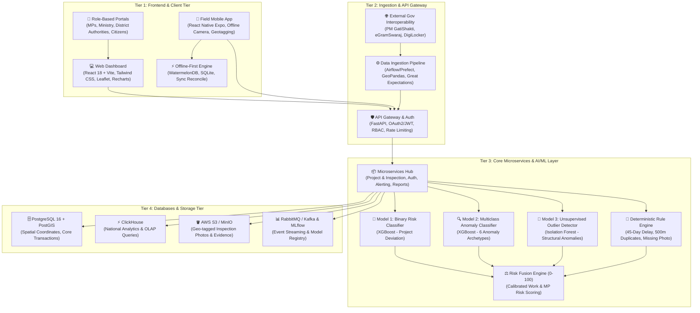

# 🏛️ MPLADS-SATHI (SIH 2026)
### *AI-Powered Monitoring, Statutory Compliance & Risk Intelligence Platform for MPLADS Governance*

[](https://python.org)
[](https://xgboost.ai)
[](https://scikit-learn.org)
[](https://fastapi.tiangolo.com)
[](https://react.dev)
[](https://www.postgresql.org)
[](LICENSE)

---

## 📌 Executive Summary

The **Members of Parliament Local Area Development Scheme (MPLADS)** allocates ₹5 Crore annually per Member of Parliament to recommend durable community development projects (roads, healthcare clinics, drinking water, schools). However, ground reality audits by the **Comptroller and Auditor General of India (CAG)** and **MoSPI** report critical governance bottlenecks:
* **Severe Underutilization**: A nationwide fund expenditure average of only **~33.9%**.
* **Statutory Violations**: Over **57% of works** breach the mandatory 45-day administrative sanction limit.
* **Audit Anomalies**: ₹161+ Crore in unverified expenditures, ghost assets (geotag / GPS mismatches), contractor clustering/syndication, and duplicate asset recommendations within proximate radii.

**MPLADS-SATHI** (*System for Automated Tracking, Hazard-detection & Inspection*) is a **defense-in-depth AI governance ecosystem** designed for **Smart India Hackathon (SIH 2026)**. It merges **supervised machine learning**, **unsupervised anomaly detection**, **geospatial intelligence**, and **deterministic statutory rule engines** to score, classify, and audit works in real time across the entire project lifecycle.

---

## 🏛️ System Architecture

The platform is organized across 4 robust tiers connected via resilient, secure, and event-driven APIs:



---

## 🧠 AI/ML Defense-in-Depth Pipeline

Rather than relying on a single black-box model, **MPLADS-SATHI** executes an ensemble of complementary artificial intelligence engines (fully documented in [`Model/README.md`](Model/README.md) and [`Model/MODEL_SRS_DOCUMENTATION.md`](Model/MODEL_SRS_DOCUMENTATION.md)):

| Engine | Technique / Model | Purpose | Verified Benchmarks & Metrics |
| :--- | :--- | :--- | :--- |
| **Model 1: Binary Risk Detector** | **XGBoost Classifier** | Evaluates whether a proposed or ongoing project deviates from clean operational benchmarks. | **99.70% Accuracy**, **0.9998 ROC-AUC**, **0.9997 5-Fold CV** |
| **Model 2: Multiclass Anomaly Classifier** | **XGBoost (`multi:softprob`)** | Pinpoints the exact fraud/risk archetype behind the anomaly across 6 distinct categories. | **98.58% Accuracy**, **0.9859 Weighted F1** (`delay_anomaly`, `cost_anomaly`, `duplicate_work`, `ghost_asset`, `vendor_anomaly`, `payment_anomaly`) |
| **Model 3: Unsupervised Outlier Detector** | **Isolation Forest** | Detects high-dimensional structural expenditure and timeline anomalies without labeled ground truth. | **1,500 Outliers Isolated (10.0%)**, Inverted continuous calibration score (0-100) |
| **Hybrid Risk Fusion Engine** | **Multi-Criteria Scoring** | Synthesizes all predictive probabilities, spatial risks, and rule flags into a calibrated **0–100 composite score**. | **Mean Score: 33.09/100**, 4 Stratified Tiers (*Low*, *Moderate*, *High*, *Critical*) |
| **Temperature & Visual Analytics** | **Matplotlib & Seaborn** | Publication-grade temperature heatmaps, state-level risk matrices, and cost vs delay scatter plots. | **16 high-resolution PNG plots** saved in `Model/dataset/` |

---

## 🧮 Mathematical Formulation of Risk Fusion

For any given work $i$, the composite Risk Score $R_i \in [0, 100]$ is computed as:

$$R_i = \min\left(100, \; 0.30 \cdot P_{\text{ML}} + 0.15 \cdot S_{\text{Iso}} + 0.20 \cdot R_{\text{Cost}} + 0.10 \cdot R_{\text{Geo}} + 0.15 \cdot R_{\text{Evidence}} + 0.10 \cdot R_{\text{Delay}}\right)$$

Where:
* $P_{\text{ML}} \in [0, 100]$: Supervised XGBoost anomaly probability from Model 1 ($P(\text{anomalous}) \times 100$).
* $S_{\text{Iso}} \in [0, 100]$: Inverted normalized Isolation Forest outlier score from Model 3.
* $R_{\text{Cost}} = \min\left(100, \; \max\left(0, \; \frac{\text{Actual} - \text{Sanctioned}}{\text{Sanctioned}} \times 100\right)\right)$: Cost overrun ratio above sanctioned limit.
* $R_{\text{Geo}} = \min(100, \; N_{\text{proximate}} \times 25)$: Spatial clustering penalty (25 pts per proximate work within 500m, from `similar_work_count_500m`).
* $R_{\text{Evidence}}$: Geotag mismatch (50 pts) + uninspected work penalty (30 pts) + missing photo (20 pts).
* $R_{\text{Delay}} = \min\left(100, \; \frac{\max(0, \; \Delta_{\text{days}} - 45)}{30} \times 20\right)$: Statutory 45-day delay penalty (from `delay_days`).

---

## 📊 High-Risk Realism & Dataset Calibrations

Unlike synthetic datasets that assume an unrealistically clean distribution, **MPLADS-SATHI** is calibrated against the **CAG Report** and actual parliamentary data:

### MP-Level Risk Distribution (542 Lok Sabha MPs across all 36 States/UTs)
```
╔═════════════════════════════════════════════════════════════════════════════╗
║                             MP RISK DISTRIBUTION                            ║
║                   (Ranked in mplads_mp_risk_leaderboard.csv)                ║
╠═════════════════════════════════════════════════════════════════════════════╣
║  🔴 High Risk         : 401 MPs (74.0%) | Avg Utilization: 34.56%           ║
║  🟡 Moderate Risk     :  88 MPs (16.2%) | Avg Utilization: 58.53%           ║
║  🟢 Clean / Exemplary :  53 MPs ( 9.8%) | Avg Utilization: 84.72%           ║
╚═════════════════════════════════════════════════════════════════════════════╝
```

### Work-Level Distribution (15,000 Works)
* **Anomalous Works**: 9,525 (63.5%) — strictly matching CAG audit proportions
* **Clean Benchmark Works**: 5,475 (36.5%)
* **Anomaly Taxonomy (Calibrated Frequencies)**:
  * ⏱️ `delay_anomaly`: 3,186 works (33.45%)
  * 💰 `cost_anomaly`: 2,354 works (24.71%)
  * 🗺️ `duplicate_work`: 1,681 works (17.64%)
  * 👻 `ghost_asset`: 995 works (10.45%)
  * 🏢 `vendor_anomaly`: 810 works (8.51%)
  * 💳 `payment_anomaly`: 499 works (5.23%)

---

## 📂 Repository Structure

```
SIH2026/
├── README.md                                # Root Project Documentation
├── CODE_OF_CONDUCT.md                       # Contributor Covenant Code of Conduct (v2.1)
├── .gitignore                               # Git ignored files & environments
│
├── Model/                                   # 🤖 AI/ML Modeling, MLOps & Risk Intelligence Engine
│   ├── README.md                            # Comprehensive Architectural Guide & Feature Specification
│   ├── MODEL_SRS_DOCUMENTATION.pdf          # 📄 20-Page Illustrated Technical Report (PDF)
│   ├── MODEL_SRS_DOCUMENTATION.md           # Formal IEEE 830-style Software Requirements Specification
│   ├── model.ipynb                          # Executed End-to-End Jupyter Notebook (16 embedded plots)
│   ├── generate_dataset.py                  # All-States Dataset Generator (36 States/UTs, 542 MPs, 15k Works)
│   ├── build_notebook.py                    # Programmatic Notebook Authoring Script (41 cells)
│   ├── generate_srs_pdf.py                  # PDF Compilation Engine (ReportLab Platypus)
│   │
│   ├── dataset/                             # [Data Layer] 15,000 Works & 542 MPs Tables
│   │    ├── MPLADS_MP_Allocated_Limit_Analysis.csv # Real MoSPI seed data
│   │    ├── mplads_mp_table.csv              # Baseline allocations for 542 MPs (36 States/UTs)
│   │    ├── mplads_work_table.csv            # 15,000 calibrated works with 26 features
│   │    └── mplads_mp_risk_leaderboard.csv   # Ranked MP risk audit leaderboard
│   │
│   ├── plots/                               # [Visual Layer] 16 Visual Intelligence Plots (PNGs)
│   │    ├── plot_anomaly_distribution.png   # Anomaly type breakdown
│   │    ├── plot_correlation_heatmap.png    # Feature correlation temperature map
│   │    ├── plot_state_risk_heatmap.png     # State-wise anomaly temperature matrix
│   │    ├── plot_cost_vs_delay_scatter.png  # Delay vs Cost Overrun temperature scatter
│   │    ├── plot_risk_fusion.png            # 4-panel Risk Fusion Engine breakdown
│   │    └── ... (11 additional high-res plots)
│   │
│   ├── training/                            # 🧱 [Base / MLOps Layer] Model Training & Export
│   │    └── export_models.py                # Serializes models, scalers, and metadata to registry
│   │
│   ├── saved_models/                        # 📦 [Model Registry] Serialized Production Artifacts
│   │    ├── xgb_binary.json                 # Model 1: XGBoost Binary Risk Classifier
│   │    ├── xgb_multi.json                  # Model 2: XGBoost Multiclass Classifier
│   │    ├── iso_forest.joblib               # Model 3: Isolation Forest Outlier Detector
│   │    ├── iso_scaler.joblib               # Standard scaler for Isolation Forest
│   │    ├── le_anomaly.joblib               # Anomaly archetype label encoder
│   │    ├── le_constituency.joblib          # Constituency reservation label encoder
│   │    └── metadata.json                   # Feature manifests, bounds, and risk weights
│   │
│   └── serving/                             # 🚀 [Execution Layer] FastAPI Service for Frontend
│        ├── api.py                          # Production FastAPI REST API with Risk Fusion Engine
│        ├── test_client.py                  # Automated verification client (test cases)
│        ├── requirements.txt                # Serving dependencies
│        └── Dockerfile                      # Container deployment configuration
│
└── Research On MPLADS/                      # 📚 Domain Research & System Assets
    ├── Datasets/
    │   └── MPLADS_MP_Allocated_Limit_Analysis.csv
    ├── Docs/
    │   ├── MPLADS_SATHI_TechStack_MLTraining_AIIntegration.pdf
    │   └── Research On MPLADS.pdf
    └── Resources or Img/                    # Architecture diagrams & schematics
        ├── MPLADS-SATHI-Architecture-4K.png
        ├── gemini-svg.svg
        └── techstack.png
```

---

## 🚀 Step-by-Step Execution Guide (Base Pipeline & Serving Engine)

The system is separated into two operational stages:
1. **Base Pipeline**: Data generation, interactive Jupyter experimentation, and automated model serialization.
2. **Execution Engine**: Production FastAPI serving server delivering sub-millisecond predictions to Frontend clients.

---

### 1. Prerequisites & Environment Setup
* Python 3.10 or higher (Python 3.11 recommended)
* Terminal with PowerShell, Bash, or Command Prompt

```bash
# Clone the repository
git clone https://github.com/CodeByPrakash/SIH2026.git
cd SIH2026

# Install core data science, MLOps, and API dependencies
pip install numpy pandas scikit-learn xgboost matplotlib seaborn jupyter fastapi uvicorn pydantic
```

---

### 2. Base Pipeline: Data Generation & Model Serialization

#### Step 1: Synthesize Nationwide All-States Datasets
Generates 15,000 project works and 542 MP profiles across all 36 States/UTs calibrated to CAG audit findings:
```powershell
cd Model
$env:PYTHONIOENCODING="utf-8"
python generate_dataset.py
```

#### Step 2: Train & Export Models to Model Registry (`saved_models/`)
Executes model training for Model 1 (Binary), Model 2 (Multiclass), and Model 3 (Isolation Forest), saving all production artifacts into `Model/saved_models/`:
```powershell
python training/export_models.py
```
*Artifacts Generated:*
* `xgb_binary.json`: Native XGBoost binary classifier (99.70% accuracy, 0.9998 ROC-AUC)
* `xgb_multi.json`: 6-archetype anomaly classifier (98.58% accuracy, 0.9859 F1)
* `iso_forest.joblib` & `iso_scaler.joblib`: Unsupervised structural outlier detector
* `le_anomaly.joblib` & `le_constituency.joblib`: Production label encoders
* `metadata.json`: Feature manifest, normalizer score bounds, and regulatory weights

#### Step 3: Interactive Jupyter Notebook (Optional)
Explore all 16 temperature maps, state risk matrices, and interactive cells:
```powershell
jupyter notebook model.ipynb
```

---

### 3. Execution Pipeline: Production FastAPI Server for Frontend

#### Step 1: Start the FastAPI Inference Server
Launch the high-performance ASGI server with live reload:
```powershell
cd Model
uvicorn serving.api:app --host 0.0.0.0 --port 8000 --reload
```

Once running, interactive documentation is immediately accessible:
* **Interactive Swagger UI**: [http://127.0.0.1:8000/docs](http://127.0.0.1:8000/docs)
* **ReDoc Specification**: [http://127.0.0.1:8000/redoc](http://127.0.0.1:8000/redoc)
* **Health Check**: `GET http://127.0.0.1:8000/api/v1/health`

#### Step 2: Run the Verification Test Client
Runs automated verification audits on a high-risk fraudulent work and a clean benchmark work:
```powershell
python serving/test_client.py
```
---
### Backend Serving For The React App
```powershell
cd Model
python -m uvicorn serving.api:app --host 0.0.0.0 --port 8000
```
---

### 4. Frontend Integration Guide (React / Next.js / TypeScript)

The FastAPI server provides full Cross-Origin Resource Sharing (**CORS**) enabled out-of-the-box (`allow_origins=["*"]`).

#### A. Frontend API Service (`auditService.ts`):
```typescript
export interface WorkAuditRequest {
  work_id: string;
  work_title: string;
  state: string;
  district: string;
  constituency: string;
  constituency_type: "General" | "SC" | "ST";
  work_category: string;
  estimated_cost_inr: number;
  sanctioned_cost_inr: number;
  actual_expenditure_inr: number;
  expected_completion_days: number;
  actual_completion_days: number;
  inspection_done: 0 | 1;
  photo_available: 0 | 1;
  photo_location_match: 0 | 1;
  similar_work_count_500m: number;
  payment_count: number;
}

export interface WorkAuditResponse {
  work_id: string;
  is_anomalous: boolean;
  anomaly_probability: number;
  predicted_archetype: string;
  composite_risk_score: number; // 0.0 to 100.0
  risk_tier: "LOW" | "MODERATE" | "HIGH" | "CRITICAL";
  governance_action: string;
  risk_drivers: string[];
}

export async function auditProjectWork(payload: WorkAuditRequest): Promise<WorkAuditResponse> {
  const res = await fetch("http://127.0.0.1:8000/api/v1/audit/single", {
    method: "POST",
    headers: { "Content-Type": "application/json" },
    body: JSON.stringify(payload),
  });
  if (!res.ok) throw new Error(`Audit request failed: ${res.statusText}`);
  return res.json();
}
```

#### B. Sample Request Payload:
```json
{
  "work_id": "WRK-MH-PUNE-2026-001",
  "work_title": "Primary Health Centre Solar Backup",
  "state": "Maharashtra",
  "district": "Pune",
  "constituency": "Pune",
  "constituency_type": "General",
  "work_category": "Healthcare",
  "estimated_cost_inr": 2500000.0,
  "sanctioned_cost_inr": 3000000.0,
  "actual_expenditure_inr": 4800000.0,
  "expected_completion_days": 60,
  "actual_completion_days": 180,
  "inspection_done": 0,
  "photo_available": 1,
  "photo_location_match": 0,
  "similar_work_count_500m": 3,
  "payment_count": 8
}
```

#### C. Sample Response Payload (Consumed by Frontend):
```json
{
  "work_id": "WRK-MH-PUNE-2026-001",
  "is_anomalous": true,
  "anomaly_probability": 1.0,
  "predicted_archetype": "vendor_anomaly",
  "archetype_confidence": 0.985,
  "composite_risk_score": 73.64,
  "risk_tier": "HIGH",
  "governance_action": "Mandatory District Field Audit — Physical site inspection required.",
  "risk_drivers": [
    "Significant Cost Overrun: +60.0% beyond sanctioned budget",
    "Statutory Delay Exceeded: 120 days past statutory grace period",
    "GPS Coordinate Mismatch: Uploaded photo does not match GIS sanction coordinates",
    "Missing Physical Site Inspection Certificate",
    "Spatial Duplication Risk: 3 proximate works within 500m radius"
  ],
  "component_breakdown": {
    "c1_supervised_ml": 100.0,
    "c2_isolation_outlier": 68.27,
    "c3_cost_overrun_penalty": 60.0,
    "c4_spatial_duplication_penalty": 75.0,
    "c5_evidence_deficit_penalty": 80.0,
    "c6_statutory_delay_penalty": 50.0
  }
}
```

---

### 5. Production Docker Deployment

Deploy the FastAPI inference engine inside an isolated Docker container:
```bash
# Build the production container
docker build -f Model/serving/Dockerfile -t mplads-sathi-api:v1 .

# Run the container
docker run -d -p 8000:8000 --name mplads-api mplads-sathi-api:v1
```

---

## 🎯 SIH 2026 Presentation Highlights

When presenting to SIH Evaluators, emphasize these three core differentiators:

1. **Grounded in Official Audit Realities (CAG & MoSPI)**:
   * Instead of treating public funds as an idealistic dataset, our system is rooted in CAG findings: the ~33.9% national utilization crisis, unverified expenditures, and contractor clustering.
2. **Multi-Role Tailored Intelligence**:
   * **Ministry National Dashboard**: Pan-India fund velocity, unspent balances, and state performance index.
   * **District Authority (DA) Inspection Queue**: Auto-prioritized triage list ensuring high-risk works are physically inspected before payments are cleared.
   * **MP Constituency Portal**: Real-time project milestone tracking, proactive delay alerts, and transparent compliance ratings.
3. **Defense-in-Depth AI**:
   * Combines fast XGBoost binary classification, multiclass root-cause identification, unsupervised Isolation Forests for novel zero-day fraud patterns, and deterministic legal rule checks.

---

## 👥 Contributors

* **Team Code_Warrior6** — Smart India Hackathon 2026
* Team Leader: [SmrutiRanjan](https://github.com/Smrutiranjan8895/)
* Lead Developer & Maintainer: [CodeByPrakash](https://github.com/CodeByPrakash)

---

## 📄 License
This project is open-source and licensed under the [MIT License](LICENSE).
