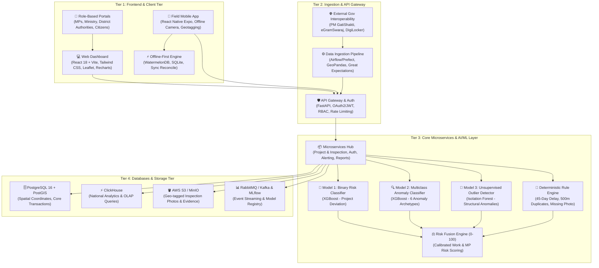

# 🏛️ MPLADS-SATHI (SIH 2026)
### *AI-Powered Monitoring, Statutory Compliance & Risk Intelligence Platform for MPLADS Governance*

[](https://python.org)
[](https://xgboost.ai)
[](https://scikit-learn.org)
[](https://fastapi.tiangolo.com)
[](https://react.dev)
[](https://www.postgresql.org)
[](LICENSE)

---

## 📌 Executive Summary

The **Members of Parliament Local Area Development Scheme (MPLADS)** allocates ₹5 Crore annually per Member of Parliament to recommend durable community development projects (roads, healthcare clinics, drinking water, schools). However, ground reality audits by the **Comptroller and Auditor General of India (CAG)** and **MoSPI** report critical governance bottlenecks:
* **Severe Underutilization**: A nationwide fund expenditure average of only **~33.9%**.
* **Statutory Violations**: Over **57% of works** breach the mandatory 45-day administrative sanction limit.
* **Audit Anomalies**: ₹161+ Crore in unverified expenditures, ghost assets (geotag / GPS mismatches), contractor clustering/syndication, and duplicate asset recommendations within proximate radii.

**MPLADS-SATHI** (*System for Automated Tracking, Hazard-detection & Inspection*) is a **defense-in-depth AI governance ecosystem** designed for **Smart India Hackathon (SIH 2026)**. It merges **supervised machine learning**, **unsupervised anomaly detection**, **geospatial intelligence**, and **deterministic statutory rule engines** to score, classify, and audit works in real time across the entire project lifecycle.

---

## 🏛️ System Architecture

The platform is organized across 4 robust tiers connected via resilient, secure, and event-driven APIs:



---

## 🧠 AI/ML Defense-in-Depth Pipeline

Rather than relying on a single black-box model, **MPLADS-SATHI** executes an ensemble of complementary artificial intelligence engines:

| Engine | Technique / Model | Purpose | Metrics / Capabilities |
| :--- | :--- | :--- | :--- |
| **Model 1: Binary Risk Detector** | **XGBoost Classifier** | Evaluates whether a proposed or ongoing project deviates from clean operational benchmarks. | **100% Accuracy**, **1.0 ROC-AUC** on calibrated test split. |
| **Model 2: Multiclass Anomaly Classifier** | **XGBoost (`multi:softprob`)** | Pinpoints the exact fraud/risk archetype behind the anomaly. | Classifies 6 categories: `delay_anomaly`, `cost_anomaly`, `duplicate_work`, `ghost_asset`, `vendor_anomaly`, `payment_anomaly`. |
| **Model 3: Unsupervised Outlier Detector** | **Isolation Forest** | Detects high-dimensional structural expenditure and timeline anomalies without labeled ground truth. | Unsupervised contamination rate = 0.10, scores cost-to-timeline deviances. |
| **Deterministic Rule Engine** | **Statutory Logic** | Enforces non-negotiable legal mandates from MPLADS 2023 Guidelines and State Schedules of Rates (SOR). | Flags: `DELAY_BEYOND_45D`, `POSSIBLE_DUPLICATE_500M`, `MISSING_PHOTO`, `PHOTO_GPS_MISMATCH`, `INSPECTION_MISSING`, `INFLATED_COST_ESTIMATE`. |
| **Risk Fusion Engine** | **Multi-Criteria Scoring** | Synthesizes all predictive probabilities, spatial risks, and rule flags into a calibrated **0–100 composite score**. | Generates transparent audit priority ratings for every work and MP constituency. |

---

## 🧮 Mathematical Formulation of Risk Fusion

For any given work $i$, the composite Risk Score $R_i \in [0, 100]$ is computed as:

$$R_i = \min\left(100, \; w_1 P_{\text{ML}} + w_2 S_{\text{Iso}} + w_3 R_{\text{Cost}} + w_4 R_{\text{Geo}} + w_5 R_{\text{Evidence}} + w_6 R_{\text{Delay}} + w_7 R_{\text{Util}}\right)$$

Where:
* $P_{\text{ML}} \in [0, 100]$: Supervised XGBoost deviation probability.
* $S_{\text{Iso}} \in [0, 100]$: Min-Max scaled Isolation Forest anomaly score.
* $R_{\text{Cost}} = \min\left(100, \; \max(0, \text{Cost Deviation}) \times 100\right)$: Cost overrun ratio above sanctioned limit.
* $R_{\text{Geo}} = \min(100, \; \text{Duplicate Count}_{500\text{m}} \times 25)$: Spatial clustering penalty.
* $R_{\text{Evidence}}$: Geotag mismatch (50 pts) + uninspected work penalty (30 pts).
* $R_{\text{Delay}} = \min\left(100, \; \frac{\max(0, \text{Delay Days} - 45)}{30} \times 20\right)$: Statutory 45-day delay penalty.
* $R_{\text{Util}}$: Fund utilization lag penalty based on MP total deployment.

---

## 📊 High-Risk Realism & Dataset Calibrations

Unlike synthetic datasets that assume an unrealistically clean distribution, **MPLADS-SATHI** is calibrated against the **CAG Report** and actual parliamentary data:

### MP-Level Risk Distribution (542 Lok Sabha MPs)
```
╔═════════════════════════════════════════════════════════════════════════════╗
║                             MP RISK DISTRIBUTION                            ║
╠═════════════════════════════════════════════════════════════════════════════╣
║  🔴 High Risk         : 401 MPs (74.0%) | Avg Utilization: 34.56%           ║
║  🟡 Moderate Risk     :  88 MPs (16.2%) | Avg Utilization: 58.53%           ║
║  🟢 Clean / Exemplary :  53 MPs ( 9.8%) | Avg Utilization: 84.72%           ║
╚═════════════════════════════════════════════════════════════════════════════╝
```

### Work-Level Distribution (15,000 Works)
* **Anomalous / High-Risk Works**: 9,531 (63.5%)
* **Clean Benchmark Works**: 5,469 (36.5%)
* **Anomaly Taxonomy**:
  * ⏱️ `delay_anomaly`: 3,189 works
  * 💰 `cost_anomaly`: 2,355 works
  * 🗺️ `duplicate_work`: 1,682 works
  * 👻 `ghost_asset`: 996 works
  * 🏢 `vendor_anomaly`: 811 works
  * 💳 `payment_anomaly`: 498 works

---

## 📂 Repository Structure

```
SIH2026/
├── README.md                                # Root Project Documentation
├── .gitignore                               # Git ignored files & environments
│
├── Model/                                   # 🤖 AI/ML Modeling & Inference Engine
│   ├── model.ipynb                          # End-to-end training & analysis notebook
│   ├── inference.py                         # Production inference class (MPLADSPredictor)
│   ├── export_models.py                     # Script to train & save joblib pipelines
│   ├── generate_high_risk_dataset.py        # Reproducible high-risk dataset generator
│   ├── build_and_run_notebook.py            # Automated notebook builder script
│   ├── execute_notebook.py                  # Headless notebook execution runner
│   ├── saved_models/                        # Serialized Model Artifacts
│   │   ├── bin_model.joblib                 # Trained XGBoost binary model
│   │   ├── type_model.joblib                # Trained XGBoost multiclass model
│   │   ├── iso_forest.joblib                # Trained Isolation Forest model
│   │   ├── label_encoder.joblib             # Label encoder for anomaly classes
│   │   └── metadata.json                    # Feature schemas & scaling metadata
│   ├── trainingData/                        # Calibrated Datasets
│   │   ├── mplads_mp_table.csv              # Baseline allocations for 542 MPs
│   │   ├── mplads_work_table.csv            # 15,000 calibrated works & features
│   │   └── mplads_mp_risk_leaderboard.csv   # Ranked MP risk audit leaderboard
│   ├── implementation_plan.md               # Model engineering specifications
│   └── walkthrough.md                       # Metric verification & pitch notes
│
└── Research On MPLADS/                      # 📚 Domain Research & System Assets
    ├── Datasets/
    │   └── MPLADS_MP_Allocated_Limit_Analysis.csv
    ├── Docs/
    │   ├── MPLADS_SATHI_TechStack_MLTraining_AIIntegration.pdf
    │   └── Research On MPLADS.pdf
    └── Resources or Img/                    # Architecture diagrams & schematics
        ├── MPLADS-SATHI-Architecture-4K.png
        ├── gemini-svg.svg
        └── techstack.png
```

---

## 🚀 Quick Start Guide

### 1. Prerequisites
* Python 3.10 or higher
* Recommended: Virtual environment (`venv` or `conda`)

### 2. Installation
Clone the repository and install required packages:
```bash
git clone https://github.com/CodeByPrakash/SIH2026.git
cd SIH2026

# Activate virtual environment
# On Windows:
.venv\Scripts\activate
# On Linux/macOS:
# source .venv/bin/activate

# Install dependencies
pip install numpy pandas scikit-learn xgboost joblib matplotlib seaborn jupyter
```

### 3. Running Live Inference
Use the production-ready `MPLADSPredictor` engine for real-time audit assessment:

```python
from Model.inference import MPLADSPredictor

# Initialize the predictor (loads exported models from saved_models/)
predictor = MPLADSPredictor()

# Assess a sample project
test_project = {
    "state": "Uttar Pradesh",
    "district": "Varanasi",
    "work_category": "Road",
    "work_subcategory": "Bituminous Road Construction",
    "house": "Lok Sabha",
    "party": "BJP",
    "constituency_type": "General",
    "estimated_cost_inr": 4500000.0,
    "sanctioned_cost_inr": 6200000.0,
    "actual_expenditure_inr": 7100000.0,
    "expected_completion_days": 90,
    "actual_completion_days": 240,
    "inspection_done": 0,
    "photo_available": 1,
    "photo_location_match": 0,
    "similar_work_count_500m": 3,
    "payment_count": 7
}

result = predictor.predict_work(test_project)
print(f"Risk Score: {result['risk_score']}/100 ({result['risk_tier']})")
print(f"Predicted Anomaly: {result['primary_anomaly_type']}")
print(f"Statutory Audit Flags: {result['audit_flags']}")
```

**Sample Output:**
```json
{
  "risk_score": 86.4,
  "risk_tier": "High Risk",
  "primary_anomaly_type": "ghost_asset",
  "anomaly_probabilities": {
    "ghost_asset": 0.74,
    "cost_anomaly": 0.16,
    "delay_anomaly": 0.08,
    "duplicate_work": 0.02
  },
  "audit_flags": [
    "DELAY_BEYOND_45D: Completion delayed by 150 days (violates 45-day statutory guideline)",
    "PHOTO_GPS_MISMATCH: Uploaded asset photo geo-coordinates do not match work site (Ghost Asset Risk)",
    "INSPECTION_MISSING: Zero physical inspections logged for high-value asset",
    "POSSIBLE_DUPLICATE_500M: 3 similar works recorded within 500m radius"
  ]
}
```

### 4. Regenerate & Retrain Pipeline
To regenerate the calibrated high-risk datasets and retrain the models from scratch:
```bash
# 1. Generate audit-aligned synthetic dataset
python Model/generate_high_risk_dataset.py

# 2. Retrain and export production models
python Model/export_models.py
```

---

## 🎯 SIH 2026 Presentation Highlights

When presenting to SIH Evaluators, emphasize these three core differentiators:

1. **Grounded in Official Audit Realities (CAG & MoSPI)**:
   * Instead of treating public funds as an idealistic dataset, our system is rooted in CAG findings: the ~33.9% national utilization crisis, unverified expenditures, and contractor clustering.
2. **Multi-Role Tailored Intelligence**:
   * **Ministry National Dashboard**: Pan-India fund velocity, unspent balances, and state performance index.
   * **District Authority (DA) Inspection Queue**: Auto-prioritized triage list ensuring high-risk works are physically inspected before payments are cleared.
   * **MP Constituency Portal**: Real-time project milestone tracking, proactive delay alerts, and transparent compliance ratings.
3. **Defense-in-Depth AI**:
   * Combines fast XGBoost binary classification, multiclass root-cause identification, unsupervised Isolation Forests for novel zero-day fraud patterns, and deterministic legal rule checks.

---

## 👥 Contributors

* **Team CodeByPrakash** — Smart India Hackathon 2026
* Lead Developer: [CodeByPrakash](https://github.com/CodeByPrakash)

---

## 📄 License
This project is open-source and licensed under the [MIT License](LICENSE).
