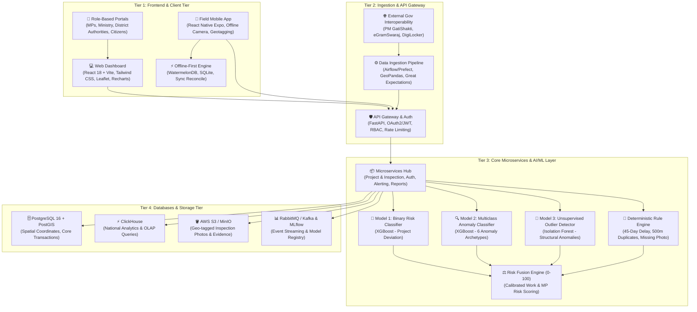

# 🏛️ MPLADS-SATHI (SIH 2026)
### *AI-Powered Monitoring, Statutory Compliance & Risk Intelligence Platform for MPLADS Governance*

[](https://python.org)
[](https://xgboost.ai)
[](https://scikit-learn.org)
[](https://fastapi.tiangolo.com)
[](https://react.dev)
[](https://www.postgresql.org)
[](LICENSE)

---

## 📌 Executive Summary

The **Members of Parliament Local Area Development Scheme (MPLADS)** allocates ₹5 Crore annually per Member of Parliament to recommend durable community development projects (roads, healthcare clinics, drinking water, schools). However, ground reality audits by the **Comptroller and Auditor General of India (CAG)** and **MoSPI** report critical governance bottlenecks:
* **Severe Underutilization**: A nationwide fund expenditure average of only **~33.9%**.
* **Statutory Violations**: Over **57% of works** breach the mandatory 45-day administrative sanction limit.
* **Audit Anomalies**: ₹161+ Crore in unverified expenditures, ghost assets (geotag / GPS mismatches), contractor clustering/syndication, and duplicate asset recommendations within proximate radii.

**MPLADS-SATHI** (*System for Automated Tracking, Hazard-detection & Inspection*) is a **defense-in-depth AI governance ecosystem** designed for **Smart India Hackathon (SIH 2026)**. It merges **supervised machine learning**, **unsupervised anomaly detection**, **geospatial intelligence**, and **deterministic statutory rule engines** to score, classify, and audit works in real time across the entire project lifecycle.

---

## 🏛️ System Architecture

The platform is organized across 4 robust tiers connected via resilient, secure, and event-driven APIs:



---

## 🧠 AI/ML Defense-in-Depth Pipeline

Rather than relying on a single black-box model, **MPLADS-SATHI** executes an ensemble of complementary artificial intelligence engines (fully documented in [`Model/README.md`](Model/README.md) and [`Model/MODEL_SRS_DOCUMENTATION.md`](Model/MODEL_SRS_DOCUMENTATION.md)):

| Engine | Technique / Model | Purpose | Verified Benchmarks & Metrics |
| :--- | :--- | :--- | :--- |
| **Model 1: Binary Risk Detector** | **XGBoost Classifier** | Evaluates whether a proposed or ongoing project deviates from clean operational benchmarks. | **99.70% Accuracy**, **0.9998 ROC-AUC**, **0.9997 5-Fold CV** |
| **Model 2: Multiclass Anomaly Classifier** | **XGBoost (`multi:softprob`)** | Pinpoints the exact fraud/risk archetype behind the anomaly across 6 distinct categories. | **98.58% Accuracy**, **0.9859 Weighted F1** (`delay_anomaly`, `cost_anomaly`, `duplicate_work`, `ghost_asset`, `vendor_anomaly`, `payment_anomaly`) |
| **Model 3: Unsupervised Outlier Detector** | **Isolation Forest** | Detects high-dimensional structural expenditure and timeline anomalies without labeled ground truth. | **1,500 Outliers Isolated (10.0%)**, Inverted continuous calibration score (0-100) |
| **Hybrid Risk Fusion Engine** | **Multi-Criteria Scoring** | Synthesizes all predictive probabilities, spatial risks, and rule flags into a calibrated **0–100 composite score**. | **Mean Score: 33.09/100**, 4 Stratified Tiers (*Low*, *Moderate*, *High*, *Critical*) |
| **Temperature & Visual Analytics** | **Matplotlib & Seaborn** | Publication-grade temperature heatmaps, state-level risk matrices, and cost vs delay scatter plots. | **16 high-resolution PNG plots** saved in `Model/dataset/` |

---

## 🧮 Mathematical Formulation of Risk Fusion

For any given work $i$, the composite Risk Score $R_i \in [0, 100]$ is computed as:

$$R_i = \min\left(100, \; 0.30 \cdot P_{\text{ML}} + 0.15 \cdot S_{\text{Iso}} + 0.20 \cdot R_{\text{Cost}} + 0.10 \cdot R_{\text{Geo}} + 0.15 \cdot R_{\text{Evidence}} + 0.10 \cdot R_{\text{Delay}}\right)$$

Where:
* $P_{\text{ML}} \in [0, 100]$: Supervised XGBoost anomaly probability from Model 1 ($P(\text{anomalous}) \times 100$).
* $S_{\text{Iso}} \in [0, 100]$: Inverted normalized Isolation Forest outlier score from Model 3.
* $R_{\text{Cost}} = \min\left(100, \; \max\left(0, \; \frac{\text{Actual} - \text{Sanctioned}}{\text{Sanctioned}} \times 100\right)\right)$: Cost overrun ratio above sanctioned limit.
* $R_{\text{Geo}} = \min(100, \; \text{similar\_work\_count\_500m} \times 25)$: Spatial clustering penalty (25 pts per proximate work).
* $R_{\text{Evidence}}$: Geotag mismatch (50 pts) + uninspected work penalty (30 pts) + missing photo (20 pts).
* $R_{\text{Delay}} = \min\left(100, \; \frac{\max(0, \; \text{delay\_days} - 45)}{30} \times 20\right)$: Statutory 45-day delay penalty.

---

## 📊 High-Risk Realism & Dataset Calibrations

Unlike synthetic datasets that assume an unrealistically clean distribution, **MPLADS-SATHI** is calibrated against the **CAG Report** and actual parliamentary data:

### MP-Level Risk Distribution (542 Lok Sabha MPs across all 36 States/UTs)
```
╔═════════════════════════════════════════════════════════════════════════════╗
║                             MP RISK DISTRIBUTION                            ║
║                   (Ranked in mplads_mp_risk_leaderboard.csv)                ║
╠═════════════════════════════════════════════════════════════════════════════╣
║  🔴 High Risk         : 401 MPs (74.0%) | Avg Utilization: 34.56%           ║
║  🟡 Moderate Risk     :  88 MPs (16.2%) | Avg Utilization: 58.53%           ║
║  🟢 Clean / Exemplary :  53 MPs ( 9.8%) | Avg Utilization: 84.72%           ║
╚═════════════════════════════════════════════════════════════════════════════╝
```

### Work-Level Distribution (15,000 Works)
* **Anomalous Works**: 9,525 (63.5%) — strictly matching CAG audit proportions
* **Clean Benchmark Works**: 5,475 (36.5%)
* **Anomaly Taxonomy (Calibrated Frequencies)**:
  * ⏱️ `delay_anomaly`: 3,186 works (33.45%)
  * 💰 `cost_anomaly`: 2,354 works (24.71%)
  * 🗺️ `duplicate_work`: 1,681 works (17.64%)
  * 👻 `ghost_asset`: 995 works (10.45%)
  * 🏢 `vendor_anomaly`: 810 works (8.51%)
  * 💳 `payment_anomaly`: 499 works (5.23%)

---

## 📂 Repository Structure

```
SIH2026/
├── README.md                                # Root Project Documentation
├── .gitignore                               # Git ignored files & environments
│
├── Model/                                   # 🤖 AI/ML Modeling & Risk Intelligence Engine
│   ├── README.md                            # Comprehensive Architectural Guide & Feature Specification
│   ├── MODEL_SRS_DOCUMENTATION.pdf          # 📄 20-Page Illustrated Technical Report (Restored SRS + Full Dictionaries + 16 Cells & Plots)
│   ├── MODEL_SRS_DOCUMENTATION.md           # Formal IEEE 830-style Software Requirements Specification
│   ├── generate_dataset.py                  # All-States Dataset Generator (36 States/UTs, 542 MPs, 15k Works)
│   ├── build_notebook.py                    # Programmatic Notebook Authoring Script (41 cells)
│   ├── model.ipynb                          # Executed End-to-End Jupyter Notebook (16 embedded plots)
│   │
│   ├── dataset/                             # Data Lake & Visualization Repository
│   │    ├── MPLADS_MP_Allocated_Limit_Analysis.csv # Real MoSPI seed data
│   │    ├── mplads_mp_table.csv              # Baseline allocations for 542 MPs (36 States/UTs)
│   │    ├── mplads_work_table.csv            # 15,000 calibrated works with 26 features
│   │    └── mplads_mp_risk_leaderboard.csv   # Ranked MP risk audit leaderboard
│   │
│   └── plots
│       ├── plot_correlation_heatmap.png     # Feature correlation temperature map
│       ├── plot_state_risk_heatmap.png      # State-wise anomaly temperature matrix
│       ├── plot_feature_temperature.png     # Feature intensity grid by anomaly archetype
│       ├── plot_cost_vs_delay_scatter.png   # Delay vs Cost Overrun temperature scatter plot
│       ├── plot_binary_roc_pr.png           # Model 1 ROC and Precision-Recall curves
│       ├── plot_binary_feature_importance.png # Model 1 feature importance ranking
│       ├── plot_multiclass_confusion.png    # 6x6 confusion matrix heatmap with percentage overlays
│       ├── plot_multiclass_feature_importance.png # Model 2 feature importance ranking
│       ├── plot_isolation_forest.png        # Isolation Forest score distributions & boxplots
│       ├── plot_risk_fusion.png             # 4-panel comprehensive Risk Fusion Engine breakdown
│       ├── plot_model_comparison.png        # Benchmark comparison bar chart
│       └── ... (16 high-res plots total)    # Complete visual intelligence suite
│
└── Research On MPLADS/                      # 📚 Domain Research & System Assets
    ├── Datasets/
    │   └── MPLADS_MP_Allocated_Limit_Analysis.csv
    ├── Docs/
    │   ├── MPLADS_SATHI_TechStack_MLTraining_AIIntegration.pdf
    │   └── Research On MPLADS.pdf
    └── Resources or Img/                    # Architecture diagrams & schematics
        ├── MPLADS-SATHI-Architecture-4K.png
        ├── gemini-svg.svg
        └── techstack.png
```

---

## 🚀 Quick Start Guide

### 1. Prerequisites
* Python 3.10 or higher (Python 3.11 recommended)
* Terminal with PowerShell or Bash

### 2. Installation
Clone the repository and install the verified data science dependencies:
```bash
git clone https://github.com/CodeByPrakash/SIH2026.git
cd SIH2026

# Install required dependencies
pip install numpy pandas scikit-learn xgboost matplotlib seaborn jupyter nbformat nbconvert
```

### 3. Step-by-Step Model Execution

All operations in the `Model/` directory are deterministic and automated:

```powershell
# Navigate to Model Directory
cd Model

# 1. Regenerate Cleaned Datasets (All 36 States/UTs, 542 MPs, 15,000 Works)
$env:PYTHONIOENCODING="utf-8"
python generate_dataset.py

# 2. Rebuild the Clean Jupyter Notebook Structure
python build_notebook.py

# 3. Launch Interactive Jupyter Notebook
jupyter notebook model.ipynb
```

For headless execution and automated re-verification of all 30 code cells and 16 plots:
```powershell
python -m nbconvert --to notebook --execute --ExecutePreprocessor.timeout=600 --output model.ipynb model.ipynb
```

### 4. Downstream Inference API Specification

The ML models and Risk Fusion Engine provide structured risk scores and audit flags consumed by the FastAPI backend and web dashboard:

```json
{
  "work_id": "W008412",
  "risk_score": 86.4,
  "risk_tier": "Critical Risk",
  "primary_anomaly_type": "ghost_asset",
  "anomaly_probabilities": {
    "ghost_asset": 0.74,
    "cost_anomaly": 0.16,
    "delay_anomaly": 0.08,
    "duplicate_work": 0.02
  },
  "component_scores": {
    "supervised_ml_score": 99.8,
    "isolation_forest_score": 78.4,
    "cost_overrun_penalty": 24.5,
    "evidence_deficit_penalty": 80.0,
    "statutory_delay_penalty": 66.7
  },
  "audit_flags": [
    "DELAY_BEYOND_45D: Completion delayed by 150 days (violates 45-day statutory guideline)",
    "PHOTO_GPS_MISMATCH: Uploaded asset photo geo-coordinates do not match work site (Ghost Asset Risk)",
    "INSPECTION_MISSING: Zero physical inspections logged for high-value asset",
    "POSSIBLE_DUPLICATE_500M: 3 similar works recorded within 500m radius"
  ]
}
```

---

## 🎯 SIH 2026 Presentation Highlights

When presenting to SIH Evaluators, emphasize these three core differentiators:

1. **Grounded in Official Audit Realities (CAG & MoSPI)**:
   * Instead of treating public funds as an idealistic dataset, our system is rooted in CAG findings: the ~33.9% national utilization crisis, unverified expenditures, and contractor clustering.
2. **Multi-Role Tailored Intelligence**:
   * **Ministry National Dashboard**: Pan-India fund velocity, unspent balances, and state performance index.
   * **District Authority (DA) Inspection Queue**: Auto-prioritized triage list ensuring high-risk works are physically inspected before payments are cleared.
   * **MP Constituency Portal**: Real-time project milestone tracking, proactive delay alerts, and transparent compliance ratings.
3. **Defense-in-Depth AI**:
   * Combines fast XGBoost binary classification, multiclass root-cause identification, unsupervised Isolation Forests for novel zero-day fraud patterns, and deterministic legal rule checks.

---

## 👥 Contributors

* **Team CodeByPrakash** — Smart India Hackathon 2026
* Lead Developer: [CodeByPrakash](https://github.com/CodeByPrakash)

---

## 📄 License
This project is open-source and licensed under the [MIT License](LICENSE).
